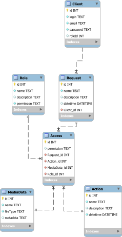

# Проєктування системи

## Модель бізнес-об'єктів

@startuml
  entity Client #d3ffd9
    entity Client.id
    entity Client.login
    entity Client.email
    entity Client.password
    entity Client.roleId

    Client.id -r-* Client
    Client.login -u-* Client
    Client.email -u-* Client
    Client.password -u-* Client
    Client.roleId -u-* Client

  entity Role #d3ffd9
    entity Role.id
    entity Role.name
    entity Role.description
    entity Role.permission

    Role.id --* Role
    Role.name --* Role
    Role.description --* Role
    Role.permission --* Role

    entity Guest
    entity User
    entity Admin

    Guest ...> Role : instanceOf
    User ...> Role : instanceOf
    Admin ...> Role : instanceOf

  entity Request #d3ffd9
    entity Request.id
    entity Request.name
    entity Request.description
    entity Request.datetime
  
    Request.id --* Request
    Request.name --* Request
    Request.description --* Request
    Request.datetime --* Request

  entity Access #d3ffd9
    entity Access.id
    entity Access.permission

    Access.id -r-* Access
    Access.permission -l-* Access

  entity Action #d3ffd9
    entity Action.id
    entity Action.name
    entity Action.description
    entity Action.datetime

    Action.id -u-* Action
    Action.name -u-* Action
    Action.description -u-* Action
    Action.datetime -u-* Action

  entity MediaData #d3ffd9
    entity MediaData.id
    entity MediaData.name
    entity MediaData.fileType
    entity MediaData.metadata

    MediaData.id -u-* MediaData
    MediaData.name -u-* MediaData
    MediaData.fileType -u-* MediaData
    MediaData.metadata -u-* MediaData

  Client "1,1"-r-"0,*" Request
  Role "1,1"--"0,*" Access
  Request "0,*"---"1,1" Access
  Access "1,1"--"0,*" Action
  Access "1,1"--"0,*" MediaData

@enduml

## ER-модель

@startuml
  package ClientManage {
      entity Client <<ENTITY>> {
        id: INT
        login: TEXT
        email: TEXT
        password: TEXT
        roleId: INT
      }
  }

  package AccessControl {
      entity Role <<ENTITY>> {
        id: INT
        name: TEXT
        description: TEXT
        permission: TEXT
      }

      object Guest #white
      object User #white
      object Admin #white

      Guest ..> Role : instanceOf
      User ..> Role : instanceOf
      Admin ..> Role : instanceOf

      entity Request <<ENTITY>> {
        id: INT
        name: TEXT
        description: TEXT
        datetime: DATETIME
      }

      entity Access <<ENTITY>> {
        id: INT
        permission: TEXT
      }
  }

  package MediaManagement {
      entity Action <<ENTITY>> {
        id: INT
        name: TEXT
        description: TEXT
        datetime: DATETIME
      }

      object SupportManage #white
      object ProfileManage #white
      object SearchManage #white
      object DataManage #white
      object ManageAccount #white
      object ManageSource #white

      SupportManage ..> Action : instanceOf
      ProfileManage ...> Action : instanceOf
      SearchManage ...> Action : instanceOf
      DataManage ...> Action : instanceOf
      ManageAccount .u.> Action : instanceOf
      ManageSource .> Action : instanceOf

      entity MediaData <<ENTITY>> {
        id: INT
        name: TEXT
        fileType: TEXT
        metadata: TEXT
      }
  }

  Client "1,1"--"0,*" Request
  Role "1,1"---"0,*" Access
  Request "0,*"---"1,1" Access
  Access "1,1"---"0,*" Action
  Access "1,1"---"0,*" MediaData

@enduml

## Реляційна схема

  

