# Тестування працездатності системи

## Запуск сервера

За командою:

```sh
node server.js
```

Вивід консолі:
<p align="left">
  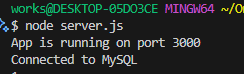
</p>

## Тестування RESTfull API через запити HTTTP

### POST

#### /sessions – АВТОРИЗАЦІЯ

На початковій стадії створення РБД було додано деякі профілі користувачів:

<p align="left">
  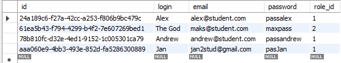
</p>

Вхід у систему за допомогою цих даних:
<p align="left">
  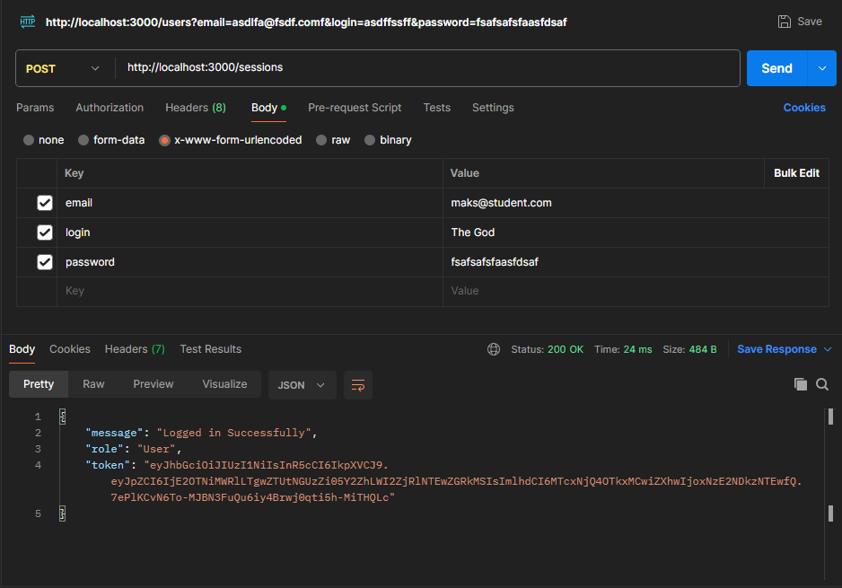
</p>

Тестування на некоректні дані:
<p align="left">
  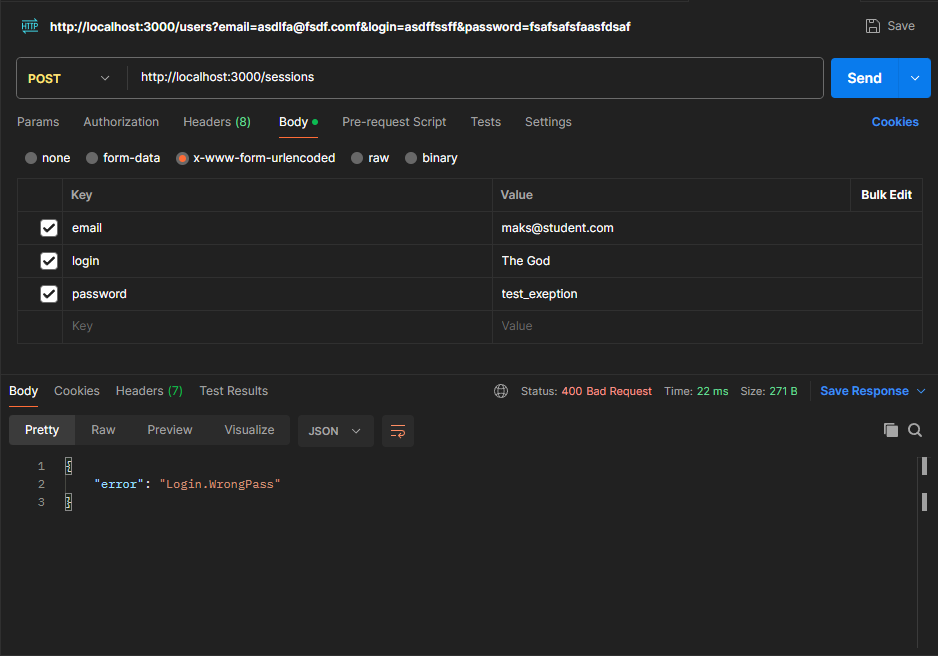
</p>

#### /users – РЕЄСТРАЦІЯ

Реєстрація нового облікового запису в системі:
<p align="left">
  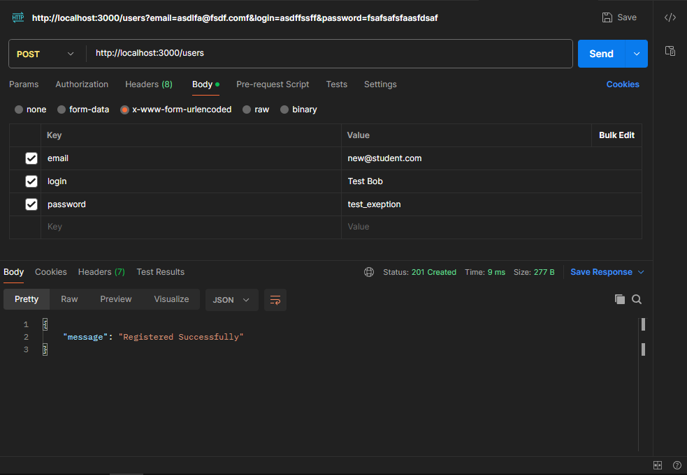
</p>

Демонстрація змін в РБД:
<p align="left">
  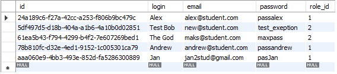
</p>

Тестування на некоректні дані (реєстрація наявного користувача):
<p align="left">
  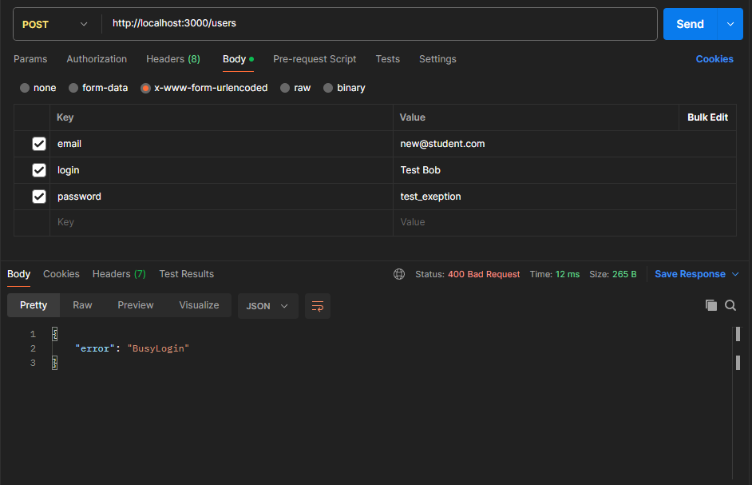
</p>

<p align="left">
  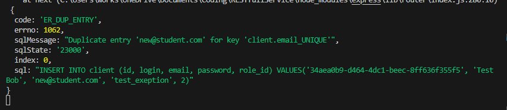
</p>

### /mediadata – ДОДАВАННЯ МЕДІАДАНИХ

Початкове наповнення таблиці `mediadata` у РДБ:
<p align="left">
  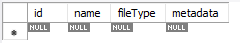
</p>

Виконання відповідного запиту HTTP:
<p align="left">
  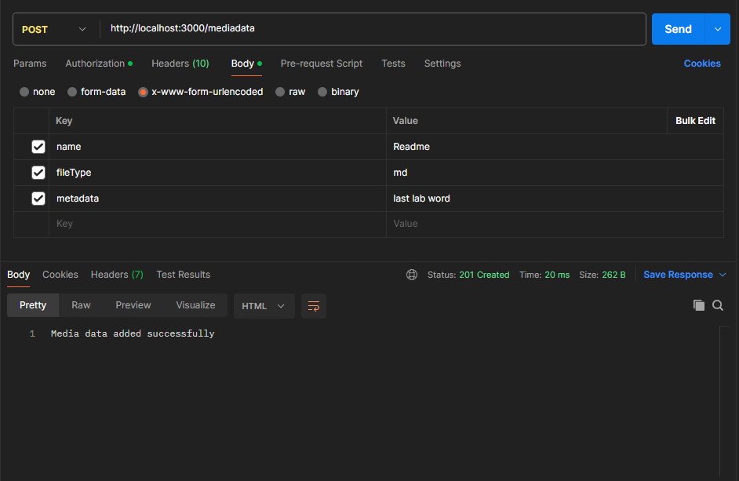
</p>

Відповідні зміни у РДБ:
<p align="left">
  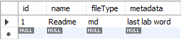
</p>

### GET

#### /mediadata:id – ОТРИМАННЯ МЕДІАДАНИХ

Відповідно за відомим ID медіа, було отримані значення з РБД:
<p align="left">
  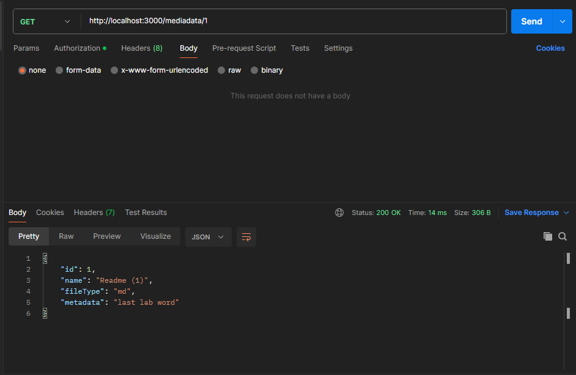
</p>

### PUT

#### /users:id – ЗМІННА ДАНИХ ОБЛІКОВОГО ЗАПИСУ

Відповідно за відомим ID облікового запису, було змінено його дані:
<p align="left">
  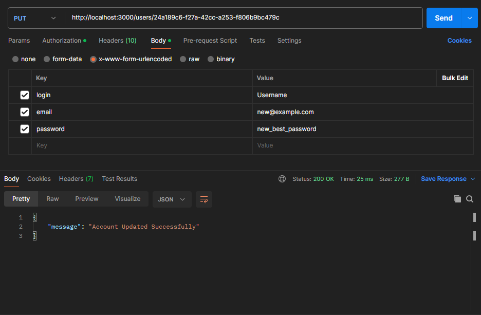
</p>

Зміни на стороні РБД:
<p align="left">
  
</p>

#### /users:id – ЗМІННА МЕДІАДАНИХ

Відповідно за відомим ID медіа, було внесенні змінени до РДБ:
<p align="left">
  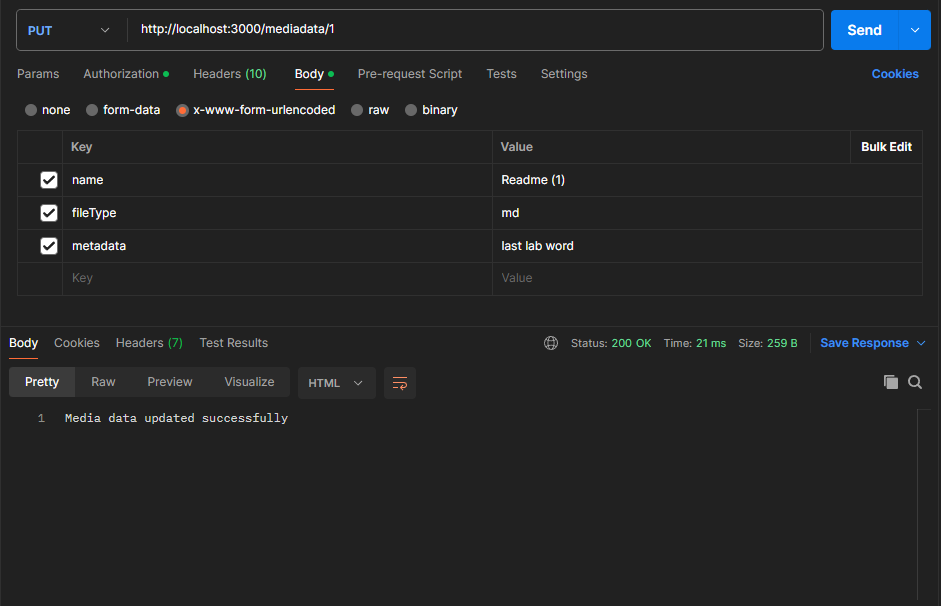
</p>

Зміни на стороні РБД:
<p align="left">
  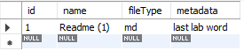
</p>

### DELETE

#### /users:id – ВИДАЛЕННЯ ОБЛІКОВОГО ЗАПИСУ

Використовуючи відповідний ID облікового запису, видалеми його з РДБ:
<p align="left">
  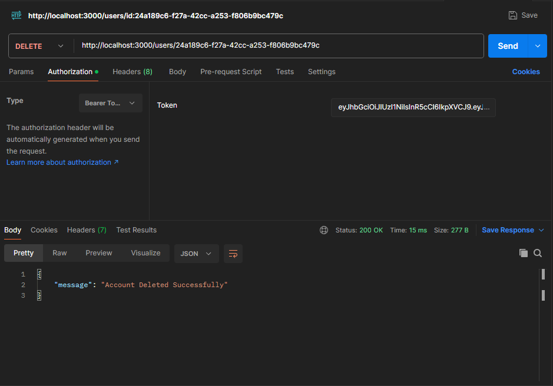
</p>

Відповідні зміни у РДБ:
<p align="left">
  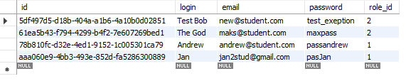
</p>

#### /mediadata:id – ВИДАЛЕННЯ МЕДІАДАНИХ

Відповідно за відомим ID медіа, було видалено необхідні медіадані з РДБ:
<p align="left">
  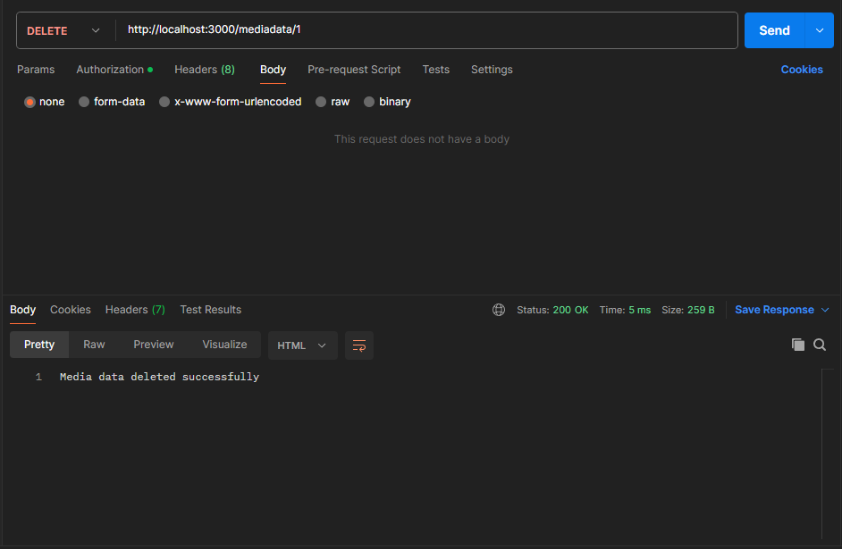
</p>

Та відповідна перевірка у Workbench:
<p align="left">
  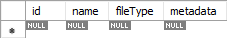
</p>